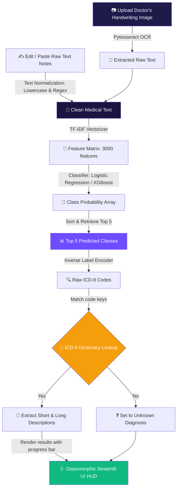

<div align="center">

# 🩺 Dr. Scribble Scanner — Medical Handwriting OCR & ICD-9 Classifier

### 🌐 **[Experience the Live Web Application](https://dr-scribble-scanner-project.streamlit.app/)**

<a href="https://dr-scribble-scanner-project.streamlit.app/" target="_blank">
  
</a>

<br/><br/>

[](https://dr-scribble-scanner-project.streamlit.app/)

[](https://git.io/typing-svg)


<br/>

### **Where OCR meets ML Diagnostic Prediction.**  
### **Real-time doctor handwriting parsing, TF-IDF vectorization, and multi-class ICD-9 classification.** 🧠

</div>

---

## ⚡ **THE CLASSIFICATION ENGINE AT A GLANCE**

### 🎯 **What Dr. Scribble Scanner Does**
Dr. Scribble Scanner is an **optimized medical handwriting transcription and diagnostic classification application** designed to parse unstructured clinical notes and predict the top 5 most likely ICD-9 diagnostic codes. Utilizing a machine learning pipeline trained on clinical discharge summaries (from the MIMIC-III database), it maps raw clinical narratives into structured diagnostic classifications. It provides a premium web-based HUD interface where users can upload medical transcriptions, run Tesseract OCR on handwritten notes, view real-time prediction confidence, and cross-reference ICD-9 descriptions with web lookups.

**Core Pipeline Pillars:**
* 📷 **Tesseract OCR Integration** → Converts image uploads of medical handwriting directly into machine-readable clinical notes.
* 🧹 **Clinical Text Normalization** → Custom regular expressions strip de-identified data tags `[**...**]` and clean non-alphabetic elements.
* 🧬 **TF-IDF Feature Space** → Transforms normalized narratives into 3000-dimensional TF-IDF matrices (unigrams & bigrams) optimized for medical vocabulary.
* 🧠 **Multi-Class Classifier** → Predicts the probability distribution across the top 50 clinical ICD-9 codes using a trained multi-class engine.
* 📊 **Glassmorphic HUD Dashboard** → A premium dark-theme interface with real-time prediction meters, text previews, and direct reference hyper-links.

### 📋 **Diagnostic Pipeline Elements**

| Pipeline Stage | Processing Target | Clinical Purpose | Representation / Tool | Icon |
| :--- | :--- | :--- | :---: | :---: |
| **OCR Text Extraction** | Handwriting Images (PNG/JPG/JPEG) | Converts digitized handwritten notes into editable raw text. | *pytesseract / Tesseract OCR* | 📷 |
| **Text Ingestion & Cleanup** | Raw Unstructured Notes / Discharge Summaries | Normalizes text, removes punctuation, metadata brackets, and sets to lowercase. | *Regex / Text Processing* | 🧹 |
| **TF-IDF Vectorization** | Normalized Medical Content | Converts clean words/bigrams into 3000-dimensional sparse feature vectors. | *TfidfVectorizer (scikit-learn)* | 🧬 |
| **ML Inference Engine** | Feature Vector (Sparse Matrix) | Analyzes text representations to predict probabilities for the top 50 ICD-9 codes. | *Logistic Regression / XGBoost* | 🧠 |
| **Dictionary Resolver** | Predicted ICD-9 Code IDs | Maps code IDs to human-readable short and long medical diagnostic descriptions. | *D_ICD_DIAGNOSES database* | 📖 |
| **Interactive Dashboard HUD** | Diagnostic Outputs & Confidence | Renders real-time confidence scores, bar indicators, and external lookups. | *Streamlit Dark-Mode HUD* | 📊 |

---

## 🛠️ **TECHNOLOGY & ARCHITECTURE STACK**

<div align="center">


</div>

| **Category** | **Technologies** | **Role & Implementation** |
| :---: | :--- | :--- |
| 🐍 **Core Parser** | Python 3.9+ / Regex / PIL | Handles raw text inputs, applies clinical sanitization templates, and loads handwriting images. |
| 👁️ **OCR Engine** | Tesseract-OCR / pytesseract | OCR extraction engine that processes visual document scans into plain text. |
| 🧬 **Feature Engineering** | Scikit-Learn (TF-IDF Vectorizer) | Extracts unigrams/bigrams, filters stop words, and creates 3000 sparse text features. |
| 🧠 **Inference Classifier** | Scikit-Learn (Logistic Regression) / XGBoost | Processes sparse matrices to estimate multi-class probabilities for top-50 ICD-9 targets. |
| 🎨 **HUD Dashboard** | Custom CSS / Streamlit | Glassmorphic, dark-mode user interface with responsive layout and probability gauges. |

---

## 🔬 **SYSTEM ARCHITECTURE FLOW**



### **Technical Breakdown:**

#### 1. Medical Text Cleaning & Normalization 🧹
To remove noise such as patient identifiers, dates, and non-alphabetic artifacts before processing:
```python
def clean_medical_text(text):
    if not isinstance(text, str):
        return ""
    text = text.lower()
    text = re.sub(r'\[\*\*.*?\*\*\]', '', text) # Remove de-identified brackets
    text = re.sub(r'[^a-zA-Z\s]', '', text)     # Remove numbers/special chars
    text = re.sub(r'\s+', ' ', text).strip()    # Remove extra whitespace
    return text
```
This strips anonymized clinical meta-tags `[**...**]` common in MIMIC datasets, focuses vectorization purely on medical words, and normalizes space boundaries.

#### 2. Pipeline Caching and Loading 💾
To minimize overhead and ensure immediate page rendering, we load all serialized models into memory once using Streamlit's `@st.cache_resource` caching decorator:
```python
@st.cache_resource
def load_ml_pipeline():
    model_path = 'models/classifier.pkl'
    vectorizer_path = 'models/vectorizer.pkl'
    encoder_path = 'models/label_encoder.pkl'
    
    if not (os.path.exists(model_path) and os.path.exists(vectorizer_path) and os.path.exists(encoder_path)):
        return None, None, None
        
    with open(vectorizer_path, 'rb') as f:
        vectorizer = pickle.load(f)
    with open(encoder_path, 'rb') as f:
        encoder = pickle.load(f)
    with open(model_path, 'rb') as f:
        model = pickle.load(f)
        
    return model, vectorizer, encoder
```

---

## 📂 **PROJECT BLUEPRINT**

```text
🩺 Dr-Scribble-Scanner/
│
├── 📂 data/                         # Persistent database and medical dictionaries
│   ├── 📜 D_ICD_DIAGNOSES.csv        # ICD-9 code description lookup database
│   ├── 📜 DIAGNOSES_ICD.csv         # Patient target diagnostics dataset
│   └── 📜 NOTEEVENTS.csv            # MIMIC-III discharge summaries (raw clinical text)
│
├── 📂 models/                       # Serialized pipeline objects
│   ├── 📜 classifier.pkl            # Trained Logistic Regression / XGBoost classifier model
│   ├── 📜 label_encoder.pkl         # Fit target classes encoder
│   └── 📜 vectorizer.pkl            # Fit TF-IDF text vectorizer model
│
├── 📜 app.py                        # Premium Glassmorphic Streamlit Dashboard
├── 📜 train.py                      # Local training script for training the classifier
├── 📜 main.ipynb                    # Jupyter Notebook for EDA & model experimentation
├── 📜 requirements.txt              # Production Python package dependencies
└── 📖 README.md                     # Documentation Hub (You are here!)
```

---

## 🚀 **GETTING STARTED & LAUNCH GUIDE**

### **Step 1: Open the Project Directory** 📥
Initialize your shell inside the project workspace:
```bash
cd "project 76 doctor handwriting"
```

### **Step 2: Install Required Dependencies** 📦
Set up your environment and dependencies:
```bash
pip install -r requirements.txt
```
> [!NOTE]
> To use the OCR features of the application, ensure that you have **Tesseract-OCR** installed on your operating system and added to your system path.

### **Step 3: Run Model Training** 🧠
If the models are not yet generated, train the classifier using the local dataset scripts:
```bash
python train.py
```

### **Step 4: Launch the Web Dashboard** 💻
Fire up the local Streamlit application server:
```bash
streamlit run app.py
```
Open your browser to start scanning clinical notes:
👉 **`http://localhost:8501`**

---

## 🛡️ **CLINICAL GOVERNANCE & RISK MITIGATION**

To ensure reliable clinical decision support (CDS) and prevent downstream errors from noisy handwriting scans, this architecture incorporates critical guardrails:

```
[Raw Handwriting Image] ➡️ [Tesseract OCR Extraction] ➡️ [Clinical Text Normalization & Regex Sanitization] ➡️ [Confidence-Calibrated ML Inference]
```

* **Polarity & Negation Preservation:** Preprocessing filters protect clinical negations (e.g., *"denies"*, *"no history of"*) from token fragmentation to avoid inverted diagnostic flags.
* **Lexical Disambiguation:** Normalization helps prevent phonetic and character-level confusion between look-alike/sound-alike clinical entities.
* **Top-5 Probabilistic Transparency:** Rather than returning an opaque single-label prediction, the HUD outputs a calibrated top-5 probability distribution with progress indicators for clinical review.
* **Traceable Dictionary Mapping:** Every predicted code links directly to standardized `D_ICD_DIAGNOSES` taxonomy definitions for instant human-in-the-loop verification.

---

## 👨‍💻 **CONNECT WITH ME**

<div align="center">

[](https://github.com/mayank-goyal09)
[](https://www.linkedin.com/in/mayank-goyal-4b8756363/)
[](https://mayank-goyal09.github.io/)

**Mayank Goyal**  
🧠 NLP & Clinical ML Developer | 📊 Medical Text Miner | 🤖 Automation Engineer

</div>

---

<div align="center">

### 🤖 **Built with ❤️ by Mayank Goyal**

*"Scan the scribble, decode the diagnosis."* 🩺💻⚡


</div>
